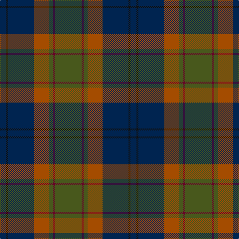

The parent of this is [Bailies of Bennachie Corporate Tartan Tartan Number: 3628. Earliest known date: 2002 The Bailes of Bennachie were founded in 1973 as caretakers of the mountain in Aberdeenshire, with the aim of 'preserving the amenity of the hill'. The tartan was produced on the occasion of the 25th anniversary to help create funds to continue their task. The colours reflect the autumn shades on the hill. See products available Copyright © Blair Urquhart, Comrie, 2015](/tartans/db/12/k4/db52/do30/g8/dr4/g/54/)

This was sourced from house-of-tartan.  It is a [7 stripes tartan](/stripes/stripes7/).

Original link http://www.house-of-tartan.scotland.net/house/TartanViewjs.asp?colr=Def&tnam=3628

## Thread count
DB/12 K4 DB52 DO30 G8 DR4 G/54

## Palette
Each colour and its ΔE from the base-6 reference it is a variant of.

| Colour | Shade | Base | ΔE (OKLab) |
|---|---|---|---|
| B |  `#1084AC` | B  | 0.20 |
| DB |  `#002450` | B  | 0.13 |
| DO |  `#A44C00` | R  | 0.10 |
| DR |  `#680028` | B  | 0.20 |
| G |  `#48581C` | G  | 0.07 |
| Ga |  `#848850` | G  | 0.20 |
| K |  `#101010` | K  | 0.17 |
| R |  `#CC4438` | R  | 0.07 |

# Sample pattern

ID: /variants/db/12/k4/db52/do30/g8/dr4/g/54-b1084ac-db002450-doa44c00-dr680028-g48581c-ga848850-k101010-rcc4438/
