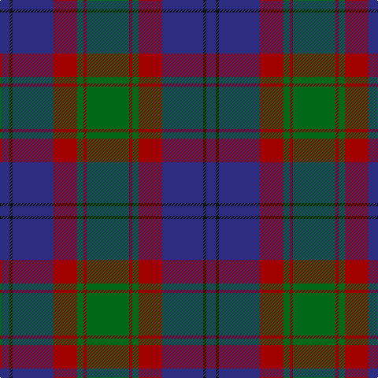

The parent of this is [Bailies of Bennachie (Corporate)](/tartans/db/12/k4/db52/dra30/g8/dr4/g/54/)

This was sourced from tartans-authority.  It is a [7 stripes tartan](/stripes/stripes7/).

Original link http://www.tartansauthority.com/tartan-ferret/display/3628/

## Thread count
DB/12 K4 DB52 DRa30 G8 DR4 G/54

## Palette
Each colour and its ΔE from the base-6 reference it is a variant of.

| Colour | Shade | Base | ΔE (OKLab) |
|---|---|---|---|
| DB |  `#2C2C80` | B  | 0.05 |
| DR |  `#880000` | R  | 0.14 |
| DRa |  `#A00000` | R  | 0.09 |
| G |  `#006818` | G  | 0.02 |
| K |  `#101010` | K  | 0.17 |

# Sample pattern

ID: /variants/db/12/k4/db52/dra30/g8/dr4/g/54-db2c2c80-dr880000-draa00000-g006818-k101010/
