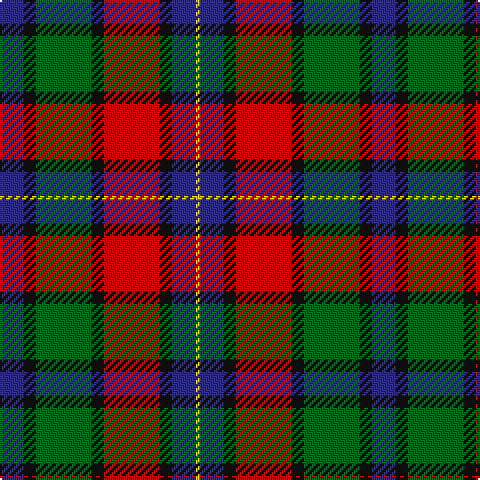

The parent of this is [Kilgour Family Tartan Tartan Number: 1979. Earliest known date: pre 2003 This sett was recorded by Peter MacDonald on the 17th of January, 1983. MacDonald was engaged in research work for the Scottish Tartans Society at the time but the correspondence up until 1985 does not indicate whether the design was ever finalised or even woven. There is a similarity in structure with the Kyle tartan recorded in 1984. Interest in the Kile tartan was revived in 1995. (Scottish Tartans Society correspondence) The name, Kyle or Kile, is associated with the Carrick District. See products available Copyright © Blair Urquhart, Comrie, 2015](/tartans/db/12/k6/g28/k6/r28/k6/db12/y/2/)

This was sourced from house-of-tartan.  It is a [8 stripes tartan](/stripes/stripes8/).

Original link http://www.house-of-tartan.scotland.net/house/TartanViewjs.asp?colr=Def&tnam=1979

## Thread count
DB/12 K6 G28 K6 R28 K6 DB12 Y/2

## Palette
Each colour and its ΔE from the base-6 reference it is a variant of.

| Colour | Shade | Base | ΔE (OKLab) |
|---|---|---|---|
| DB |  `#2C2C80` | B  | 0.05 |
| G |  `#006818` | G  | 0.02 |
| K |  `#101010` | K  | 0.17 |
| R |  `#C80000` | R  | 0.00 |
| Y |  `#E8C000` | Y  | 0.00 |

# Sample pattern

ID: /variants/db/12/k6/g28/k6/r28/k6/db12/y/2-db2c2c80-g006818-k101010-rc80000-ye8c000/
