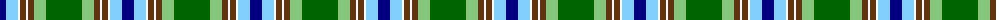

The parent of this is [Iroquois Falls Centenary](/tartans/db/12/lb12/w2/t6/w2/t6/lg12/g/36/)

This was sourced from register-of-tartans.  It is a [8 stripes tartan](/stripes/stripes8/).

Original link https://www.tartanregister.gov.uk/tartanDetails.aspx?ref=10574

## Thread count
DB/12 LB12 W2 T6 W2 T6 LG12 G/36

## Palette
Each colour and its ΔE from the base-6 reference it is a variant of.

| Colour | Shade | Base | ΔE (OKLab) |
|---|---|---|---|
| DB |  `#000080` | B  | 0.14 |
| G |  `#006400` | G  | 0.00 |
| LB |  `#82CFFD` | W  | 0.18 |
| LG |  `#86C67C` | Y  | 0.14 |
| T |  `#603311` | G  | 0.18 |
| W |  `#FFFFFF` | W  | 0.03 |

# Sample pattern

ID: /variants/db/12/lb12/w2/t6/w2/t6/lg12/g/36-db000080-g006400-lb82cffd-lg86c67c-t603311-wffffff/
