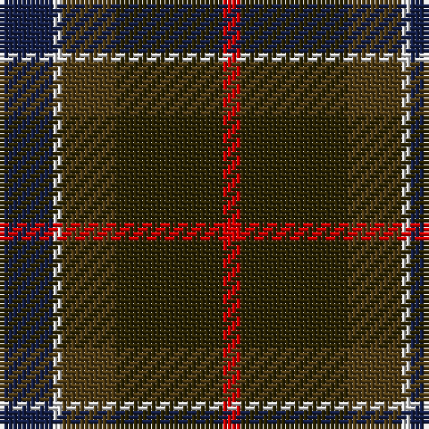

The parent of this is [Vass (Personal)](/tartans/db/12/ln2/t12/k24/r/4/)

This was sourced from register-of-tartans.  It is a [5 stripes tartan](/stripes/stripes5/).

Original link https://www.tartanregister.gov.uk/tartanDetails.aspx?ref=4444

## Thread count
DB/12 LN2 T12 K24 R/4

## Palette
Each colour and its ΔE from the base-6 reference it is a variant of.

| Colour | Shade | Base | ΔE (OKLab) |
|---|---|---|---|
| DB |  `#141E46` | B  | 0.15 |
| K |  `#2A2303` | B  | 0.21 |
| LN |  `#E0E0E0` | W  | 0.06 |
| R |  `#DC0000` | R  | 0.04 |
| T |  `#503C14` | G  | 0.15 |

# Sample pattern

ID: /variants/db/12/ln2/t12/k24/r/4-db141e46-k2a2303-lne0e0e0-rdc0000-t503c14/
