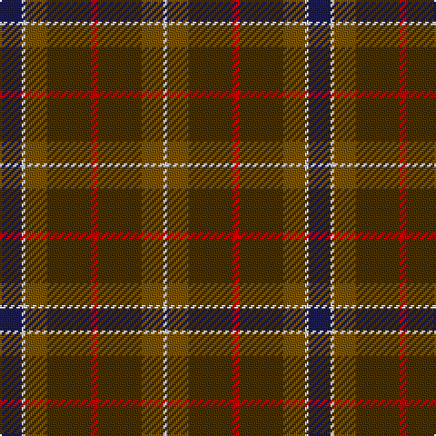

The parent of this is [Vass (Personal)](/tartans/db/12/ln2/t12/ta24/r4/ta24/t12/ln/2/)

This was sourced from tartans-authority.  It is a [8 stripes tartan](/stripes/stripes8/).

Original link http://www.tartansauthority.com/tartan-ferret/display/7150/

## Thread count
DB/12 LN2 T12 Ta24 R4 Ta24 T12 LN/2

## Palette
Each colour and its ΔE from the base-6 reference it is a variant of.

| Colour | Shade | Base | ΔE (OKLab) |
|---|---|---|---|
| DB |  `#1C1C50` | B  | 0.14 |
| LN |  `#E0E0E0` | W  | 0.06 |
| R |  `#C80000` | R  | 0.00 |
| T |  `#7C5400` | G  | 0.15 |
| Ta |  `#483000` | G  | 0.17 |

# Sample pattern

ID: /variants/db/12/ln2/t12/ta24/r4/ta24/t12/ln/2-db1c1c50-lne0e0e0-rc80000-t7c5400-ta483000/
