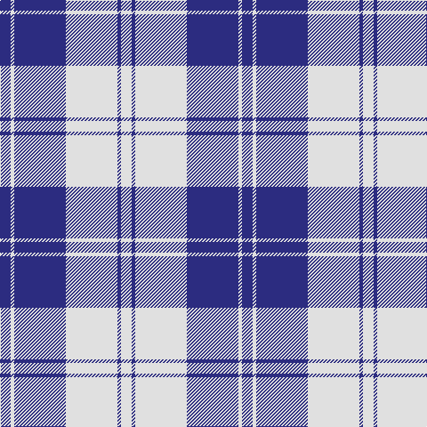

The parent of this is [Erskine Royal Blue Dress Clan Tartan Tartan Number: 632. Earliest known date: 1980 One of a number of dress tartans produced by Hugh Macpherson, a kiltmaker in Edinburgh, intended for dancing and other informal occassions. The 'dress' version of clan tartan is usually created by substituting white for one of the 'ground' colours. See products available Copyright © Blair Urquhart, Comrie, 2015](/tartans/db/12/ln4/db58/ln58/db4/ln/12/)

This was sourced from house-of-tartan.  It is a [6 stripes tartan](/stripes/stripes6/).

Original link http://www.house-of-tartan.scotland.net/house/TartanViewjs.asp?colr=Def&tnam=632

## Thread count
DB/12 LN4 DB58 LN58 DB4 LN/12

## Palette
Each colour and its ΔE from the base-6 reference it is a variant of.

| Colour | Shade | Base | ΔE (OKLab) |
|---|---|---|---|
| DB |  `#2C2C80` | B  | 0.05 |
| LN |  `#E0E0E0` | W  | 0.06 |

# Sample pattern

ID: /variants/db/12/ln4/db58/ln58/db4/ln/12-db2c2c80-lne0e0e0/
