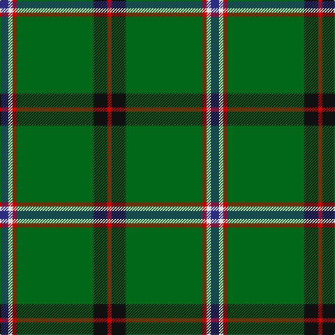

The parent of this is [Military Medical Memorial (USA)(Corp](/tartans/db/12/ln6/r6/g110/k20/r/6/)

This was sourced from tartans-authority.  It is a [6 stripes tartan](/stripes/stripes6/).

Original link http://www.tartansauthority.com/tartan-ferret/display/10141/

## Thread count
DB/12 LN6 R6 G110 K20 R/6

## Palette
Each colour and its ΔE from the base-6 reference it is a variant of.

| Colour | Shade | Base | ΔE (OKLab) |
|---|---|---|---|
| DB |  `#2C2C80` | B  | 0.05 |
| G |  `#006818` | G  | 0.02 |
| K |  `#101010` | K  | 0.17 |
| LN |  `#E0E0E0` | W  | 0.06 |
| R |  `#C80000` | R  | 0.00 |

# Sample pattern

ID: /variants/db/12/ln6/r6/g110/k20/r/6-db2c2c80-g006818-k101010-lne0e0e0-rc80000/
