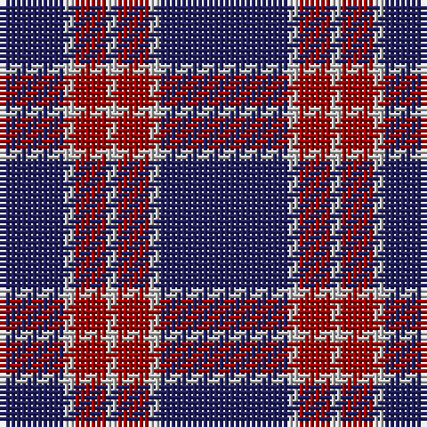

The parent of this is [BC Corps of Commissionaires, The](/tartans/db/12/n2/dr6/n2/dr6/n2/db/24/)

This was sourced from tartans-authority.  It is a [7 stripes tartan](/stripes/stripes7/).

Original link http://www.tartansauthority.com/tartan-ferret/display/11090/

## Thread count
DB/12 N2 DR6 N2 DR6 N2 DB/24

## Palette
Each colour and its ΔE from the base-6 reference it is a variant of.

| Colour | Shade | Base | ΔE (OKLab) |
|---|---|---|---|
| DB |  `#202060` | B  | 0.11 |
| DR |  `#A00000` | R  | 0.09 |
| N |  `#C0C0C0` | W  | 0.16 |

# Sample pattern

ID: /variants/db/12/n2/dr6/n2/dr6/n2/db/24-db202060-dra00000-nc0c0c0/
