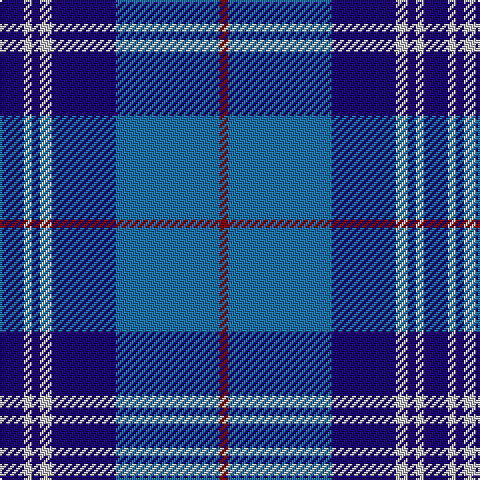

The parent of this is [FBI (Corporate)](/tartans/db/12/n4/db4/n6/db32/b52/dr/4/)

This was sourced from tartans-authority.  It is a [7 stripes tartan](/stripes/stripes7/).

Original link http://www.tartansauthority.com/tartan-ferret/display/83/

## Thread count
DB/12 N4 DB4 N6 DB32 B52 DR/4

## Palette
Each colour and its ΔE from the base-6 reference it is a variant of.

| Colour | Shade | Base | ΔE (OKLab) |
|---|---|---|---|
| B |  `#1870A4` | B  | 0.14 |
| DB |  `#1C0070` | B  | 0.14 |
| DR |  `#880000` | R  | 0.14 |
| N |  `#C0C0C0` | W  | 0.16 |

# Sample pattern

ID: /variants/db/12/n4/db4/n6/db32/b52/dr/4-b1870a4-db1c0070-dr880000-nc0c0c0/
