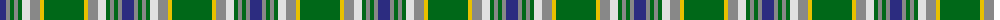

The parent of this is [Boucherville (Tartan de..) District Tartan Tartan Number: 2119. Earliest known date: 1990 From the notes accompanying the petition for accreditation. "Les symboles ont cette remarquable propriete de reunir en une expression imagee des notions diverses. Ils refletent l'histoire, les croyances, les idealogies et les aspirations de groupes humains habitant un territoire precis. Les tisserands, c'est nous tous....!" See products available Copyright © Blair Urquhart, Comrie, 2015](/tartans/db/12/n4/g4/n4/g4/ln8/n10/y4/g/40/)

This was sourced from house-of-tartan.  It is a [9 stripes tartan](/stripes/stripes9/).

Original link http://www.house-of-tartan.scotland.net/house/TartanViewjs.asp?colr=Def&tnam=2119

## Thread count
DB/12 N4 G4 N4 G4 LN8 N10 Y4 G/40

## Palette
Each colour and its ΔE from the base-6 reference it is a variant of.

| Colour | Shade | Base | ΔE (OKLab) |
|---|---|---|---|
| DB |  `#2C2C80` | B  | 0.05 |
| G |  `#006818` | G  | 0.02 |
| LN |  `#E0E0E0` | W  | 0.06 |
| N |  `#888888` | R  | 0.24 |
| Y |  `#E8C000` | Y  | 0.00 |

ID: /variants/db/12/n4/g4/n4/g4/ln8/n10/y4/g/40-db2c2c80-g006818-lne0e0e0-n888888-ye8c000/
