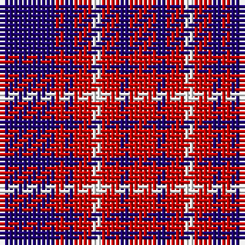

The parent of this is [Edinburgh Marketing (Corporate)](/tartans/db/12/r2/db2/r4/w2/r4/db2/r/6/)

This was sourced from tartans-authority.  It is a [8 stripes tartan](/stripes/stripes8/).

Original link http://www.tartansauthority.com/tartan-ferret/display/2106/

## Thread count
DB/12 R2 DB2 R4 W2 R4 DB2 R/6

## Palette
Each colour and its ΔE from the base-6 reference it is a variant of.

| Colour | Shade | Base | ΔE (OKLab) |
|---|---|---|---|
| DB |  `#1C0070` | B  | 0.14 |
| R |  `#C80000` | R  | 0.00 |
| W |  `#FCFCFC` | W  | 0.03 |

# Sample pattern

ID: /variants/db/12/r2/db2/r4/w2/r4/db2/r/6-db1c0070-rc80000-wfcfcfc/
