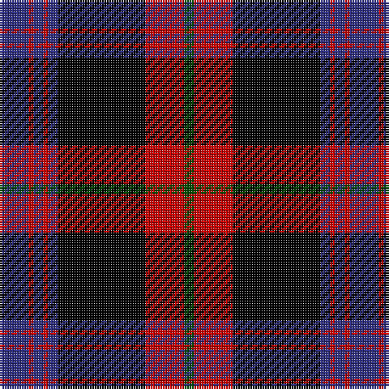

The parent of this is [Brown](/tartans/db/12/r2/db4/r2/db4/k36/r16/g/4/)

This was sourced from register-of-tartans.  It is a [8 stripes tartan](/stripes/stripes8/).

Original link https://www.tartanregister.gov.uk/tartanDetails.aspx?ref=391

## Thread count
DB/12 R2 DB4 R2 DB4 K36 R16 G/4

## Palette
Each colour and its ΔE from the base-6 reference it is a variant of.

| Colour | Shade | Base | ΔE (OKLab) |
|---|---|---|---|
| DB |  `#2C2C80` | B  | 0.05 |
| G |  `#004800` | G  | 0.09 |
| K |  `#000000` | K  | 0.00 |
| R |  `#C80000` | R  | 0.00 |

# Sample pattern

ID: /variants/db/12/r2/db4/r2/db4/k36/r16/g/4-db2c2c80-g004800-k000000-rc80000/
