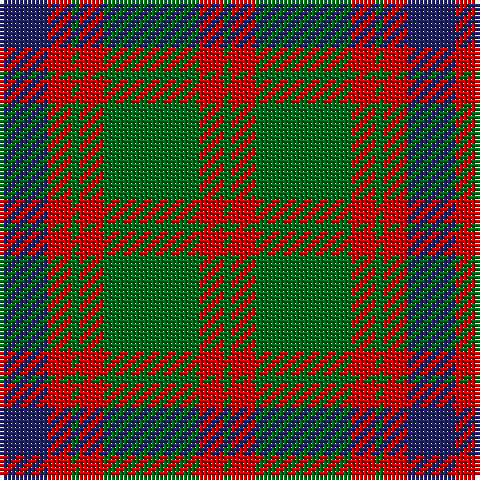

The parent of this is [Skene - 1831 (Clan)](/tartans/db/12/r6/g2/r6/g24/r6/g/2/)

This was sourced from tartans-authority.  It is a [7 stripes tartan](/stripes/stripes7/).

Original link http://www.tartansauthority.com/tartan-ferret/display/516/

## Thread count
DB/12 R6 G2 R6 G24 R6 G/2

## Palette
Each colour and its ΔE from the base-6 reference it is a variant of.

| Colour | Shade | Base | ΔE (OKLab) |
|---|---|---|---|
| DB |  `#202060` | B  | 0.11 |
| G |  `#006818` | G  | 0.02 |
| R |  `#C80000` | R  | 0.00 |

# Sample pattern

ID: /variants/db/12/r6/g2/r6/g24/r6/g/2-db202060-g006818-rc80000/
