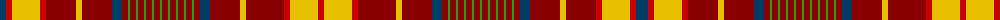

The parent of this is [Confrerie de Vouvray Corporate Tartan Tartan Number: 5802. Earliest known date: 2003 The Confrerie de Vouvray tartan was created for the French Order of Wine Growers by the Chevaliers Ecossais de la Chantepleure de Vouvray. The red, yellow and maroon are the colours of the french order and the grid pattern of green lines depict the rows of vines of the Chenin Blanc grape. The tartan was presented as a gift to the Grand Council at the 2nd Scottish Confrerie, held in Dundee in May 2003. See products available Copyright © Blair Urquhart, Comrie, 2015](/tartans/db/12/r6/y28/r6/dr30/y6/dr30/db10/dr6/g2/dr6/g2/dr6/g2/dr6/g2/dr6/g2/dr6/g2/dr6/g2/dr6/g2/dr6/g2/dr6/db10/dr30/y6/dr38/r6/y28/r/6/)

This was sourced from house-of-tartan.  It is a [34 stripes tartan](/stripes/stripes34/).

Original link http://www.house-of-tartan.scotland.net/house/TartanViewjs.asp?colr=Def&tnam=5802

## Thread count
DB/12 R6 Y28 R6 DR30 Y6 DR30 DB10 DR6 G2 DR6 G2 DR6 G2 DR6 G2 DR6 G2 DR6 G2 DR6 G2 DR6 G2 DR6 G2 DR6 DB10 DR30 Y6 DR38 R6 Y28 R/6

## Palette
Each colour and its ΔE from the base-6 reference it is a variant of.

| Colour | Shade | Base | ΔE (OKLab) |
|---|---|---|---|
| DB |  `#003C64` | B  | 0.07 |
| DR |  `#880000` | R  | 0.14 |
| G |  `#289C18` | G  | 0.18 |
| R |  `#C80000` | R  | 0.00 |
| Y |  `#E8C000` | Y  | 0.00 |

ID: /variants/db/12/r6/y28/r6/dr30/y6/dr30/db10/dr6/g2/dr6/g2/dr6/g2/dr6/g2/dr6/g2/dr6/g2/dr6/g2/dr6/g2/dr6/g2/dr6/db10/dr30/y6/dr38/r6/y28/r/6-db003c64-dr880000-g289c18-rc80000-ye8c000/
