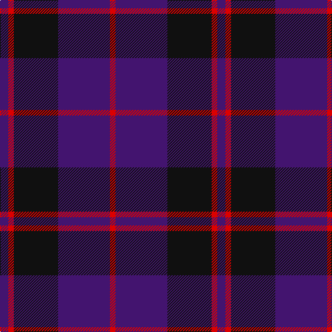

The parent of this is [Laurel Cadre, The](/tartans/db/12/r8/k64/db75/r/8/)

This was sourced from register-of-tartans.  It is a [5 stripes tartan](/stripes/stripes5/).

Original link https://www.tartanregister.gov.uk/tartanDetails.aspx?ref=11395

## Thread count
DB/12 R8 K64 DB75 R/8

## Palette
Each colour and its ΔE from the base-6 reference it is a variant of.

| Colour | Shade | Base | ΔE (OKLab) |
|---|---|---|---|
| DB |  `#43146F` | B  | 0.11 |
| K |  `#101010` | K  | 0.17 |
| R |  `#DC0000` | R  | 0.04 |

# Sample pattern

ID: /variants/db/12/r8/k64/db75/r/8-db43146f-k101010-rdc0000/
