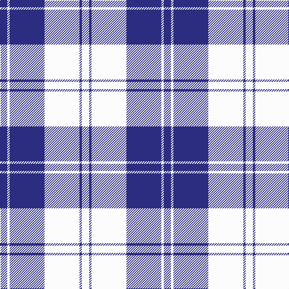

The parent of this is [Erskine, Blue (Dance)](/tartans/db/12/w4/db58/w58/db4/w/12/)

This was sourced from tartans-authority.  It is a [6 stripes tartan](/stripes/stripes6/).

Original link http://www.tartansauthority.com/tartan-ferret/display/632/

## Thread count
DB/12 W4 DB58 W58 DB4 W/12

## Palette
Each colour and its ΔE from the base-6 reference it is a variant of.

| Colour | Shade | Base | ΔE (OKLab) |
|---|---|---|---|
| DB |  `#2C2C80` | B  | 0.05 |
| W |  `#FCFCFC` | W  | 0.03 |

# Sample pattern

ID: /variants/db/12/w4/db58/w58/db4/w/12-db2c2c80-wfcfcfc/
