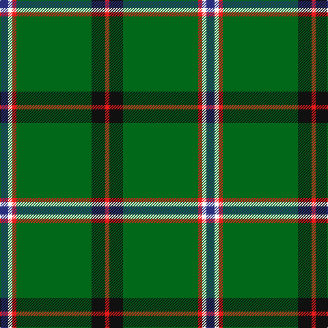

The parent of this is [Military Medical Memorial (USA)](/tartans/db/12/w6/r6/g110/k20/r/6/)

This was sourced from register-of-tartans.  It is a [6 stripes tartan](/stripes/stripes6/).

Original link https://www.tartanregister.gov.uk/tartanDetails.aspx?ref=10141

## Thread count
DB/12 W6 R6 G110 K20 R/6

## Palette
Each colour and its ΔE from the base-6 reference it is a variant of.

| Colour | Shade | Base | ΔE (OKLab) |
|---|---|---|---|
| DB |  `#292E7F` | B  | 0.05 |
| G |  `#016819` | G  | 0.02 |
| K |  `#101010` | K  | 0.17 |
| R |  `#EC1A1B` | R  | 0.08 |
| W |  `#FFFFFF` | W  | 0.03 |

# Sample pattern

ID: /variants/db/12/w6/r6/g110/k20/r/6-db292e7f-g016819-k101010-rec1a1b-wffffff/
