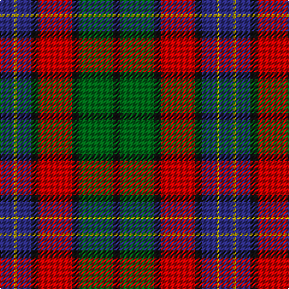

The parent of this is [Kilgour (Cant)](/tartans/db/12/y2/db12/k6/r28/k6/g28/k/6/)

This was sourced from register-of-tartans.  It is a [8 stripes tartan](/stripes/stripes8/).

Original link https://www.tartanregister.gov.uk/tartanDetails.aspx?ref=1969

## Thread count
DB/12 Y2 DB12 K6 R28 K6 G28 K/6

## Palette
Each colour and its ΔE from the base-6 reference it is a variant of.

| Colour | Shade | Base | ΔE (OKLab) |
|---|---|---|---|
| DB |  `#2C2C80` | B  | 0.05 |
| G |  `#006818` | G  | 0.02 |
| K |  `#101010` | K  | 0.17 |
| R |  `#C80000` | R  | 0.00 |
| Y |  `#E8C000` | Y  | 0.00 |

# Sample pattern

ID: /variants/db/12/y2/db12/k6/r28/k6/g28/k/6-db2c2c80-g006818-k101010-rc80000-ye8c000/
