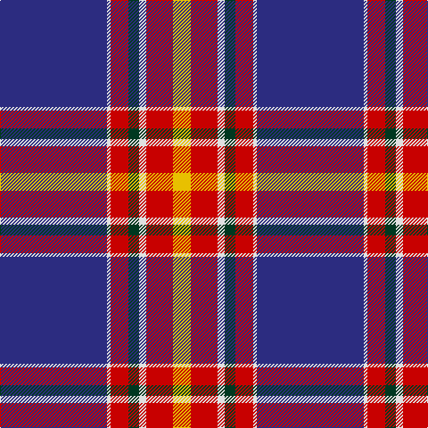

The parent of this is [Iberia Dress, Blue (Fashion)](/tartans/db/120/ln4/r20/dg12/ln8/r30/y/20/)

This was sourced from tartans-authority.  It is a [7 stripes tartan](/stripes/stripes7/).

Original link http://www.tartansauthority.com/tartan-ferret/display/6973/

## Thread count
DB/120 LN4 R20 DG12 LN8 R30 Y/20

## Palette
Each colour and its ΔE from the base-6 reference it is a variant of.

| Colour | Shade | Base | ΔE (OKLab) |
|---|---|---|---|
| DB |  `#2C2C80` | B  | 0.05 |
| DG |  `#003820` | G  | 0.16 |
| LN |  `#E0E0E0` | W  | 0.06 |
| R |  `#C80000` | R  | 0.00 |
| Y |  `#E8C000` | Y  | 0.00 |

# Sample pattern

ID: /variants/db/120/ln4/r20/dg12/ln8/r30/y/20-db2c2c80-dg003820-lne0e0e0-rc80000-ye8c000/
