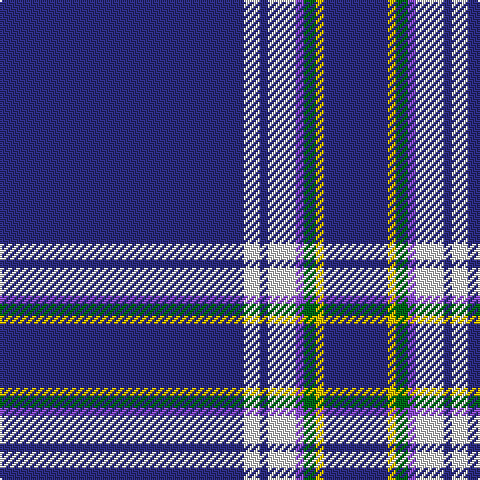

The parent of this is [Boat of Garten (District)](/tartans/db/122/ln8/db4/ln14/p4/g6/y4/db/32/)

This was sourced from tartans-authority.  It is a [8 stripes tartan](/stripes/stripes8/).

Original link http://www.tartansauthority.com/tartan-ferret/display/7347/

## Thread count
DB/122 LN8 DB4 LN14 P4 G6 Y4 DB/32

## Palette
Each colour and its ΔE from the base-6 reference it is a variant of.

| Colour | Shade | Base | ΔE (OKLab) |
|---|---|---|---|
| DB |  `#2C2C80` | B  | 0.05 |
| G |  `#006818` | G  | 0.02 |
| LN |  `#E0E0E0` | W  | 0.06 |
| P |  `#9050D8` | B  | 0.22 |
| Y |  `#E8C000` | Y  | 0.00 |

# Sample pattern

ID: /variants/db/122/ln8/db4/ln14/p4/g6/y4/db/32-db2c2c80-g006818-lne0e0e0-p9050d8-ye8c000/
