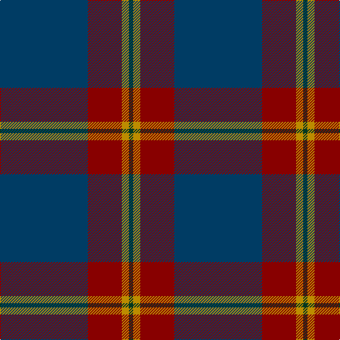

The parent of this is [Meaux (Personal)](/tartans/db/124/dr48/dy10/dg/6/)

This was sourced from tartans-authority.  It is a [4 stripes tartan](/stripes/stripes4/).

Original link http://www.tartansauthority.com/tartan-ferret/display/10738/

## Thread count
DB/124 DR48 DY10 DG/6

## Palette
Each colour and its ΔE from the base-6 reference it is a variant of.

| Colour | Shade | Base | ΔE (OKLab) |
|---|---|---|---|
| DB |  `#003C64` | B  | 0.07 |
| DG |  `#003820` | G  | 0.16 |
| DR |  `#880000` | R  | 0.14 |
| DY |  `#BC8C00` | Y  | 0.16 |

# Sample pattern

ID: /variants/db/124/dr48/dy10/dg/6-db003c64-dg003820-dr880000-dybc8c00/
