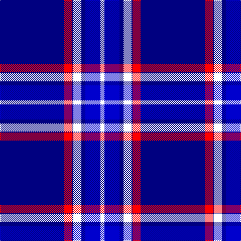

The parent of this is [North Carolina](/tartans/db/128/r16/db2/w16/db8/b30/w/8/)

This was sourced from register-of-tartans.  It is a [7 stripes tartan](/stripes/stripes7/).

Original link https://www.tartanregister.gov.uk/tartanDetails.aspx?ref=3153

## Thread count
DB/128 R16 DB2 W16 DB8 B30 W/8

## Palette
Each colour and its ΔE from the base-6 reference it is a variant of.

| Colour | Shade | Base | ΔE (OKLab) |
|---|---|---|---|
| B |  `#0000CD` | B  | 0.15 |
| DB |  `#000080` | B  | 0.14 |
| R |  `#FF0000` | R  | 0.11 |
| W |  `#FFFFFF` | W  | 0.03 |

# Sample pattern

ID: /variants/db/128/r16/db2/w16/db8/b30/w/8-b0000cd-db000080-rff0000-wffffff/
