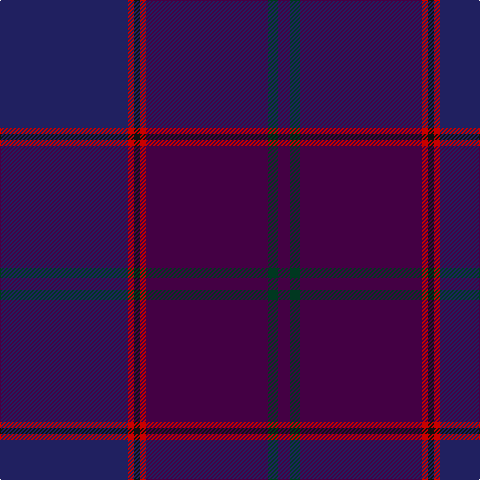

The parent of this is [Rutherford, John (Personal)](/tartans/db/128/r6/k6/r6/dp122/dg10/dp/12/)

This was sourced from tartans-authority.  It is a [7 stripes tartan](/stripes/stripes7/).

Original link http://www.tartansauthority.com/tartan-ferret/display/10937/

## Thread count
DB/128 R6 K6 R6 DP122 DG10 DP/12

## Palette
Each colour and its ΔE from the base-6 reference it is a variant of.

| Colour | Shade | Base | ΔE (OKLab) |
|---|---|---|---|
| DB |  `#202060` | B  | 0.11 |
| DG |  `#003820` | G  | 0.16 |
| DP |  `#440044` | B  | 0.17 |
| K |  `#101010` | K  | 0.17 |
| R |  `#C80000` | R  | 0.00 |

# Sample pattern

ID: /variants/db/128/r6/k6/r6/dp122/dg10/dp/12-db202060-dg003820-dp440044-k101010-rc80000/
