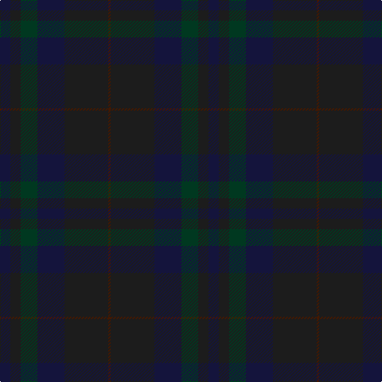

The parent of this is [Bouncing Blackie (Personal)](/tartans/db/13/k13/dg21/db34/k55/dr/3/)

This was sourced from register-of-tartans.  It is a [6 stripes tartan](/stripes/stripes6/).

Original link https://www.tartanregister.gov.uk/tartanDetails.aspx?ref=5805

## Thread count
DB/13 K13 DG21 DB34 K55 DR/3

## Palette
Each colour and its ΔE from the base-6 reference it is a variant of.

| Colour | Shade | Base | ΔE (OKLab) |
|---|---|---|---|
| DB |  `#14143C` | B  | 0.18 |
| DG |  `#003820` | G  | 0.16 |
| DP |  `#440044` | B  | 0.17 |
| DR |  `#441800` | B  | 0.22 |
| K |  `#1C1C1C` | B  | 0.20 |

# Sample pattern

ID: /variants/db/13/k13/dg21/db34/k55/dr/3-db14143c-dg003820-dp440044-dr441800-k1c1c1c/
