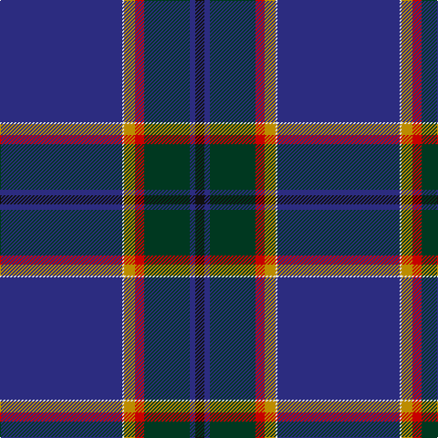

The parent of this is [Guide Dogs](/tartans/db/134/ln2/dy12/r10/dg50/db6/k/10/)

This was sourced from register-of-tartans.  It is a [7 stripes tartan](/stripes/stripes7/).

Original link https://www.tartanregister.gov.uk/tartanDetails.aspx?ref=5572

## Thread count
DB/134 LN2 DY12 R10 DG50 DB6 K/10

## Palette
Each colour and its ΔE from the base-6 reference it is a variant of.

| Colour | Shade | Base | ΔE (OKLab) |
|---|---|---|---|
| DB |  `#2C2C80` | B  | 0.05 |
| DG |  `#003820` | G  | 0.16 |
| DY |  `#BC8C00` | Y  | 0.16 |
| K |  `#101010` | K  | 0.17 |
| LN |  `#E0E0E0` | W  | 0.06 |
| R |  `#C80000` | R  | 0.00 |
| Y |  `#E8C000` | Y  | 0.00 |

# Sample pattern

ID: /variants/db/134/ln2/dy12/r10/dg50/db6/k/10-db2c2c80-dg003820-dybc8c00-k101010-lne0e0e0-rc80000-ye8c000/
