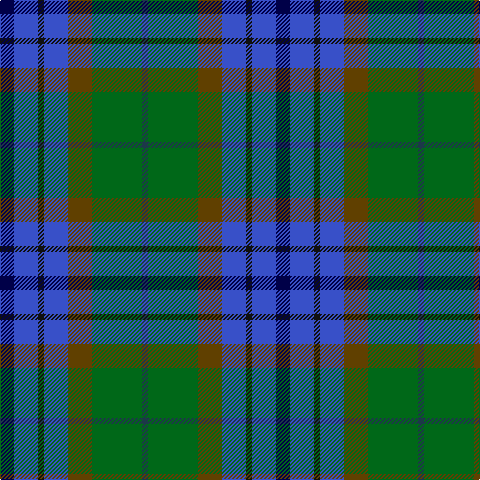

The parent of this is [Scottish Odyssey (Fashion)](/tartans/db/14/b24/k6/b24/t24/g50/dn/6/)

This was sourced from tartans-authority.  It is a [7 stripes tartan](/stripes/stripes7/).

Original link http://www.tartansauthority.com/tartan-ferret/display/4071/

## Thread count
DB/14 B24 K6 B24 T24 G50 DN/6

## Palette
Each colour and its ΔE from the base-6 reference it is a variant of.

| Colour | Shade | Base | ΔE (OKLab) |
|---|---|---|---|
| B |  `#3850C8` | B  | 0.12 |
| DB |  `#000048` | B  | 0.21 |
| DN |  `#1C3848` | B  | 0.11 |
| G |  `#006818` | G  | 0.02 |
| K |  `#101010` | K  | 0.17 |
| T |  `#604000` | G  | 0.14 |

# Sample pattern

ID: /variants/db/14/b24/k6/b24/t24/g50/dn/6-b3850c8-db000048-dn1c3848-g006818-k101010-t604000/
