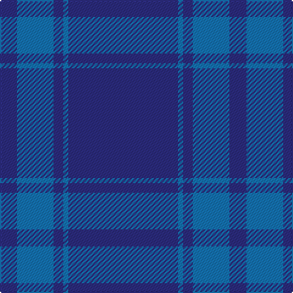

The parent of this is [Asahi (Corporate)](/tartans/db/14/b30/db8/b4/db/90/)

This was sourced from tartans-authority.  It is a [5 stripes tartan](/stripes/stripes5/).

Original link http://www.tartansauthority.com/tartan-ferret/display/6677/

## Thread count
DB/14 B30 DB8 B4 DB/90

## Palette
Each colour and its ΔE from the base-6 reference it is a variant of.

| Colour | Shade | Base | ΔE (OKLab) |
|---|---|---|---|
| B |  `#1474B4` | B  | 0.15 |
| DB |  `#2C2C80` | B  | 0.05 |
| LN |  `#E0E0E0` | W  | 0.06 |

# Sample pattern

ID: /variants/db/14/b30/db8/b4/db/90-b1474b4-db2c2c80-lne0e0e0/
