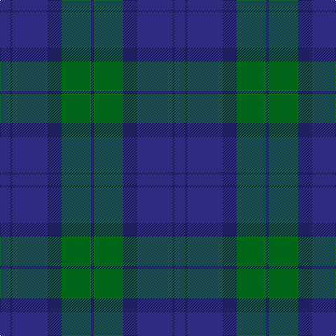

The parent of this is [Sugiyama Jogakuen University (Corp)](/tartans/db/14/dba4/db50/dba20/g42/dba/4/)

This was sourced from tartans-authority.  It is a [6 stripes tartan](/stripes/stripes6/).

Original link http://www.tartansauthority.com/tartan-ferret/display/10639/

## Thread count
DB/14 DBa4 DB50 DBa20 G42 DBa/4

## Palette
Each colour and its ΔE from the base-6 reference it is a variant of.

| Colour | Shade | Base | ΔE (OKLab) |
|---|---|---|---|
| DB |  `#2C2C80` | B  | 0.05 |
| DBa |  `#202060` | B  | 0.11 |
| G |  `#006818` | G  | 0.02 |

# Sample pattern

ID: /variants/db/14/dba4/db50/dba20/g42/dba/4-db2c2c80-dba202060-g006818/
