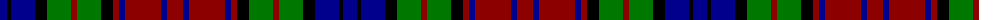

The parent of this is [Unidentified Sample #2](/tartans/db/14/k4/db24/k12/g24/dr6/g24/k12/dr6/db6/dr36/db6/dr/16/)

This was sourced from register-of-tartans.  It is a [13 stripes tartan](/stripes/stripes13/).

Original link https://www.tartanregister.gov.uk/tartanDetails.aspx?ref=4364

## Thread count
DB/14 K4 DB24 K12 G24 DR6 G24 K12 DR6 DB6 DR36 DB6 DR/16

## Palette
Each colour and its ΔE from the base-6 reference it is a variant of.

| Colour | Shade | Base | ΔE (OKLab) |
|---|---|---|---|
| B |  `#788CB4` | B  | 0.25 |
| DB |  `#00008C` | B  | 0.13 |
| DR |  `#8C0000` | R  | 0.13 |
| DY |  `#C88C00` | Y  | 0.15 |
| G |  `#007800` | G  | 0.06 |
| K |  `#000000` | K  | 0.00 |
| N |  `#C8C8C8` | W  | 0.13 |
| P |  `#64008C` | B  | 0.13 |

ID: /variants/db/14/k4/db24/k12/g24/dr6/g24/k12/dr6/db6/dr36/db6/dr/16-b788cb4-db00008c-dr8c0000-dyc88c00-g007800-k000000-nc8c8c8-p64008c/
