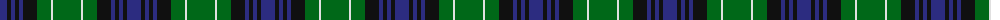

The parent of this is [Abercrombie](/tartans/db/14/k4/db4/k4/db4/k14/g14/ln2/g/28/)

This was sourced from register-of-tartans.  It is a [9 stripes tartan](/stripes/stripes9/).

Original link https://www.tartanregister.gov.uk/tartanDetails.aspx?ref=10

## Thread count
DB/14 K4 DB4 K4 DB4 K14 G14 LN2 G/28

## Palette
Each colour and its ΔE from the base-6 reference it is a variant of.

| Colour | Shade | Base | ΔE (OKLab) |
|---|---|---|---|
| DB |  `#2C2C80` | B  | 0.05 |
| DG |  `#003820` | G  | 0.16 |
| G |  `#006818` | G  | 0.02 |
| K |  `#101010` | K  | 0.17 |
| LN |  `#E0E0E0` | W  | 0.06 |

ID: /variants/db/14/k4/db4/k4/db4/k14/g14/ln2/g/28-db2c2c80-dg003820-g006818-k101010-lne0e0e0/
