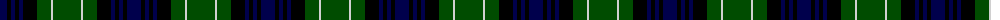

The parent of this is [Abercrombie](/tartans/db/14/k4/db4/k4/db4/k14/g14/n2/g/28/)

This was sourced from weddslist.  It is a [9 stripes tartan](/stripes/stripes9/).

Original link http://www.weddslist.com/cgi-bin/tartans/pg.pl?source=rb

## Thread count
DB/14 K4 DB4 K4 DB4 K14 G14 N2 G/28

## Palette
Each colour and its ΔE from the base-6 reference it is a variant of.

| Colour | Shade | Base | ΔE (OKLab) |
|---|---|---|---|
| DB |  `#00004C` | B  | 0.21 |
| G |  `#004C00` | G  | 0.08 |
| K |  `#000000` | K  | 0.00 |
| N |  `#D0D0D0` | W  | 0.11 |

ID: /variants/db/14/k4/db4/k4/db4/k14/g14/n2/g/28-db00004c-g004c00-k000000-nd0d0d0/
