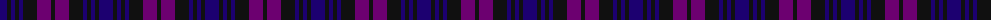
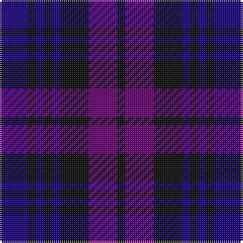

The parent of this is [Glasgow Academy (Corporate)](/tartans/db/14/k4/db4/k4/db4/k14/p14/k/4/)

This was sourced from tartans-authority.  It is a [8 stripes tartan](/stripes/stripes8/).

Original link http://www.tartansauthority.com/tartan-ferret/display/2052/

## Thread count
DB/14 K4 DB4 K4 DB4 K14 P14 K/4

## Palette
Each colour and its ΔE from the base-6 reference it is a variant of.

| Colour | Shade | Base | ΔE (OKLab) |
|---|---|---|---|
| DB |  `#1C0070` | B  | 0.14 |
| K |  `#101010` | K  | 0.17 |
| P |  `#6C0070` | B  | 0.15 |

# Sample pattern

ID: /variants/db/14/k4/db4/k4/db4/k14/p14/k/4-db1c0070-k101010-p6c0070/
