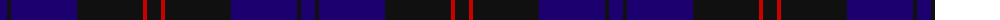

The parent of this is [Casterton (Corporate)](/tartans/db/14/k4/db66/k66/r4/k/14/)

This was sourced from tartans-authority.  It is a [6 stripes tartan](/stripes/stripes6/).

Original link http://www.tartansauthority.com/tartan-ferret/display/8060/

## Thread count
DB/14 K4 DB66 K66 R4 K/14

## Palette
Each colour and its ΔE from the base-6 reference it is a variant of.

| Colour | Shade | Base | ΔE (OKLab) |
|---|---|---|---|
| DB |  `#1C0070` | B  | 0.14 |
| K |  `#101010` | K  | 0.17 |
| R |  `#C80000` | R  | 0.00 |

# Sample pattern

ID: /variants/db/14/k4/db66/k66/r4/k/14-db1c0070-k101010-rc80000/
