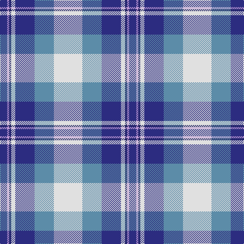

The parent of this is [St Andrews Dress, Earl of.. District Tartan Tartan Number: 45. Earliest known date: pre 2003 See products available Copyright © Blair Urquhart, Comrie, 2015](/tartans/db/14/lp4/dba4/ln8/db38/b38/ln/56/)

This was sourced from house-of-tartan.  It is a [7 stripes tartan](/stripes/stripes7/).

Original link http://www.house-of-tartan.scotland.net/house/TartanViewjs.asp?colr=Def&tnam=45

## Thread count
DB/14 LP4 DBa4 LN8 DB38 B38 LN/56

## Palette
Each colour and its ΔE from the base-6 reference it is a variant of.

| Colour | Shade | Base | ΔE (OKLab) |
|---|---|---|---|
| B |  `#5C8CA8` | B  | 0.23 |
| DB |  `#2C2C80` | B  | 0.05 |
| DBa |  `#202060` | B  | 0.11 |
| LN |  `#E0E0E0` | W  | 0.06 |
| LP |  `#C49CD8` | W  | 0.24 |

# Sample pattern

ID: /variants/db/14/lp4/dba4/ln8/db38/b38/ln/56-b5c8ca8-db2c2c80-dba202060-lne0e0e0-lpc49cd8/
