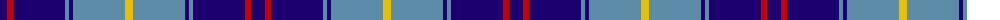

The parent of this is [Int. Police Association (Official)](/tartans/db/14/r6/db52/b4/db4/b52/y/8/)

This was sourced from tartans-authority.  It is a [7 stripes tartan](/stripes/stripes7/).

Original link http://www.tartansauthority.com/tartan-ferret/display/10174/

## Thread count
DB/14 R6 DB52 B4 DB4 B52 Y/8

## Palette
Each colour and its ΔE from the base-6 reference it is a variant of.

| Colour | Shade | Base | ΔE (OKLab) |
|---|---|---|---|
| B |  `#5C8CA8` | B  | 0.23 |
| DB |  `#1C0070` | B  | 0.14 |
| R |  `#C80000` | R  | 0.00 |
| Y |  `#E8C000` | Y  | 0.00 |

# Sample pattern

ID: /variants/db/14/r6/db52/b4/db4/b52/y/8-b5c8ca8-db1c0070-rc80000-ye8c000/
