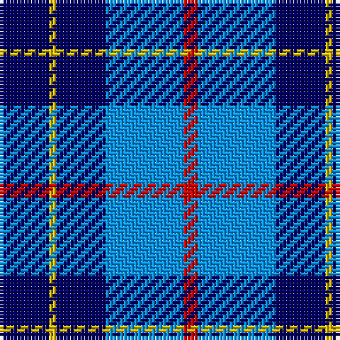

The parent of this is [Brazell (Personal)](/tartans/db/14/y2/db14/b22/r/4/)

This was sourced from register-of-tartans.  It is a [5 stripes tartan](/stripes/stripes5/).

Original link https://www.tartanregister.gov.uk/tartanDetails.aspx?ref=344

## Thread count
DB/14 Y2 DB14 B22 R/4

## Palette
Each colour and its ΔE from the base-6 reference it is a variant of.

| Colour | Shade | Base | ΔE (OKLab) |
|---|---|---|---|
| B |  `#0596FA` | B  | 0.28 |
| DB |  `#000064` | B  | 0.17 |
| R |  `#DC0000` | R  | 0.04 |
| Y |  `#E8C000` | Y  | 0.00 |

# Sample pattern

ID: /variants/db/14/y2/db14/b22/r/4-b0596fa-db000064-rdc0000-ye8c000/
