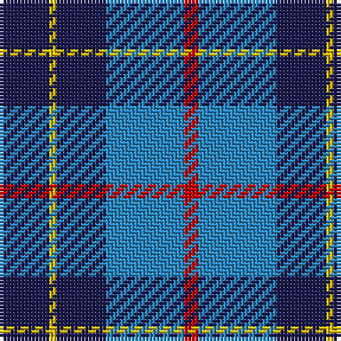

The parent of this is [Brazell (Personal)](/tartans/db/14/y2/db14/b22/r/4/)

This was sourced from tartans-authority.  It is a [5 stripes tartan](/stripes/stripes5/).

Original link http://www.tartansauthority.com/tartan-ferret/display/7348/

## Thread count
DB/14 Y2 DB14 B22 R/4

## Palette
Each colour and its ΔE from the base-6 reference it is a variant of.

| Colour | Shade | Base | ΔE (OKLab) |
|---|---|---|---|
| B |  `#2888C4` | B  | 0.21 |
| DB |  `#1C1C50` | B  | 0.14 |
| R |  `#C80000` | R  | 0.00 |
| Y |  `#E8C000` | Y  | 0.00 |

# Sample pattern

ID: /variants/db/14/y2/db14/b22/r/4-b2888c4-db1c1c50-rc80000-ye8c000/
