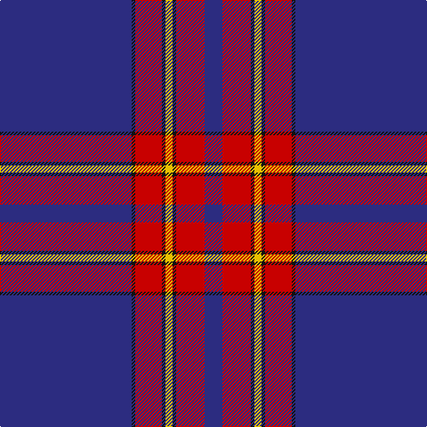

The parent of this is [Salvation Army Dress (Corporate)](/tartans/db/148/k4/r30/k4/y8/k4/r32/db/20/)

This was sourced from tartans-authority.  It is a [8 stripes tartan](/stripes/stripes8/).

Original link http://www.tartansauthority.com/tartan-ferret/display/546/

## Thread count
DB/148 K4 R30 K4 Y8 K4 R32 DB/20

## Palette
Each colour and its ΔE from the base-6 reference it is a variant of.

| Colour | Shade | Base | ΔE (OKLab) |
|---|---|---|---|
| DB |  `#2C2C80` | B  | 0.05 |
| K |  `#101010` | K  | 0.17 |
| R |  `#C80000` | R  | 0.00 |
| Y |  `#E8C000` | Y  | 0.00 |

# Sample pattern

ID: /variants/db/148/k4/r30/k4/y8/k4/r32/db/20-db2c2c80-k101010-rc80000-ye8c000/
