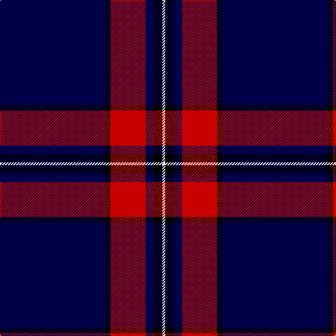

The parent of this is [Hong Kong St Andrew's Society](/tartans/db/150/k8/r50/db12/k12/w/4/)

This was sourced from register-of-tartans.  It is a [6 stripes tartan](/stripes/stripes6/).

Original link https://www.tartanregister.gov.uk/tartanDetails.aspx?ref=11499

## Thread count
DB/150 K8 R50 DB12 K12 W/4

## Palette
Each colour and its ΔE from the base-6 reference it is a variant of.

| Colour | Shade | Base | ΔE (OKLab) |
|---|---|---|---|
| DB |  `#000048` | B  | 0.21 |
| K |  `#000000` | K  | 0.00 |
| R |  `#C80000` | R  | 0.00 |
| W |  `#F8F8F8` | W  | 0.01 |

# Sample pattern

ID: /variants/db/150/k8/r50/db12/k12/w/4-db000048-k000000-rc80000-wf8f8f8/
