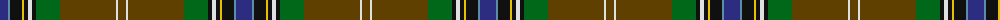

The parent of this is [MacLean of Kingairloch Clan Tartan Tartan Number: 61. Earliest known date: pre 2003 Reproduction. See products available Copyright © Blair Urquhart, Comrie, 2015](/tartans/db/16/b2/k12/y2/k4/ln4/k4/g24/t56/ln2/t/8/)

This was sourced from house-of-tartan.  It is a [11 stripes tartan](/stripes/stripes11/).

Original link http://www.house-of-tartan.scotland.net/house/TartanViewjs.asp?colr=Def&tnam=61

## Thread count
DB/16 B2 K12 Y2 K4 LN4 K4 G24 T56 LN2 T/8

## Palette
Each colour and its ΔE from the base-6 reference it is a variant of.

| Colour | Shade | Base | ΔE (OKLab) |
|---|---|---|---|
| B |  `#5C8CA8` | B  | 0.23 |
| DB |  `#2C2C80` | B  | 0.05 |
| G |  `#006818` | G  | 0.02 |
| K |  `#101010` | K  | 0.17 |
| LN |  `#E0E0E0` | W  | 0.06 |
| T |  `#604000` | G  | 0.14 |
| Y |  `#E8C000` | Y  | 0.00 |

ID: /variants/db/16/b2/k12/y2/k4/ln4/k4/g24/t56/ln2/t/8-b5c8ca8-db2c2c80-g006818-k101010-lne0e0e0-t604000-ye8c000/
