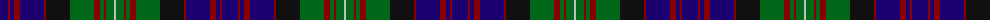

The parent of this is [MacDonell of Glengarry - 1914 (Clan)](/tartans/db/16/dr2/db4/dr6/db24/dr2/k24/g24/dr6/g4/dr2/g8/n/2/)

This was sourced from tartans-authority.  It is a [13 stripes tartan](/stripes/stripes13/).

Original link http://www.tartansauthority.com/tartan-ferret/display/471/

## Thread count
DB/16 DR2 DB4 DR6 DB24 DR2 K24 G24 DR6 G4 DR2 G8 N/2

## Palette
Each colour and its ΔE from the base-6 reference it is a variant of.

| Colour | Shade | Base | ΔE (OKLab) |
|---|---|---|---|
| DB |  `#1C0070` | B  | 0.14 |
| DR |  `#880000` | R  | 0.14 |
| G |  `#006818` | G  | 0.02 |
| K |  `#101010` | K  | 0.17 |
| N |  `#C0C0C0` | W  | 0.16 |

ID: /variants/db/16/dr2/db4/dr6/db24/dr2/k24/g24/dr6/g4/dr2/g8/n/2-db1c0070-dr880000-g006818-k101010-nc0c0c0/
