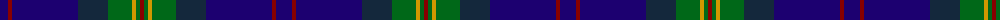

The parent of this is [Moray Council (Corporate)](/tartans/db/16/dr4/db66/dn30/g24/dy4/g4/dr/4/)

This was sourced from tartans-authority.  It is a [8 stripes tartan](/stripes/stripes8/).

Original link http://www.tartansauthority.com/tartan-ferret/display/2494/

## Thread count
DB/16 DR4 DB66 DN30 G24 DY4 G4 DR/4

## Palette
Each colour and its ΔE from the base-6 reference it is a variant of.

| Colour | Shade | Base | ΔE (OKLab) |
|---|---|---|---|
| DB |  `#1C0070` | B  | 0.14 |
| DN |  `#14283C` | B  | 0.14 |
| DR |  `#880000` | R  | 0.14 |
| DY |  `#D09800` | Y  | 0.11 |
| G |  `#006818` | G  | 0.02 |

# Sample pattern

ID: /variants/db/16/dr4/db66/dn30/g24/dy4/g4/dr/4-db1c0070-dn14283c-dr880000-dyd09800-g006818/
