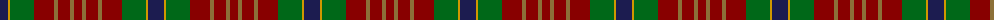
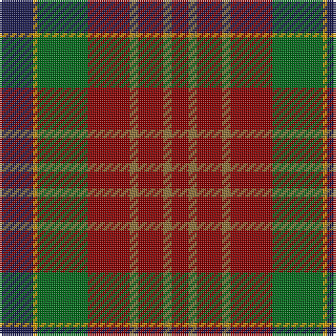

The parent of this is [Indiana "Cardinal" (District)](/tartans/db/16/dy2/g24/dr20/lt4/dr12/lt4/dr/8/)

This was sourced from tartans-authority.  It is a [8 stripes tartan](/stripes/stripes8/).

Original link http://www.tartansauthority.com/tartan-ferret/display/5251/

## Thread count
DB/16 DY2 G24 DR20 LT4 DR12 LT4 DR/8

## Palette
Each colour and its ΔE from the base-6 reference it is a variant of.

| Colour | Shade | Base | ΔE (OKLab) |
|---|---|---|---|
| DB |  `#1C1C50` | B  | 0.14 |
| DR |  `#880000` | R  | 0.14 |
| DY |  `#D09800` | Y  | 0.11 |
| G |  `#006818` | G  | 0.02 |
| LT |  `#8C7038` | G  | 0.18 |

# Sample pattern

ID: /variants/db/16/dy2/g24/dr20/lt4/dr12/lt4/dr/8-db1c1c50-dr880000-dyd09800-g006818-lt8c7038/
