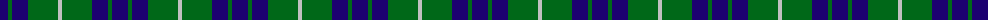
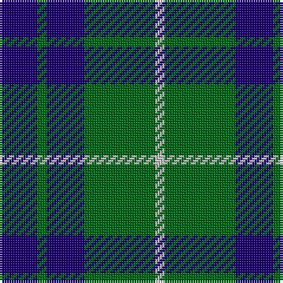

The parent of this is [Hamilton Green (Hunting)](/tartans/db/16/g4/db16/g30/n/4/)

This was sourced from tartans-authority.  It is a [5 stripes tartan](/stripes/stripes5/).

Original link http://www.tartansauthority.com/tartan-ferret/display/139/

## Thread count
DB/16 G4 DB16 G30 N/4

## Palette
Each colour and its ΔE from the base-6 reference it is a variant of.

| Colour | Shade | Base | ΔE (OKLab) |
|---|---|---|---|
| DB |  `#1C0070` | B  | 0.14 |
| G |  `#006818` | G  | 0.02 |
| N |  `#C0C0C0` | W  | 0.16 |

# Sample pattern

ID: /variants/db/16/g4/db16/g30/n/4-db1c0070-g006818-nc0c0c0/
