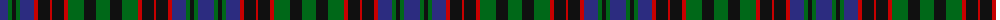

The parent of this is [Stewart of Achnacone Clan Tartan Tartan Number: 160. Earliest known date: c.1815 'As made for Achnacone by P.J. Haggart, Aberfeldy...' See products available Copyright © Blair Urquhart, Comrie, 2015](/tartans/db/16/g4/k4/g4/db14/r4/k12/r2/k12/r4/g16/k12/g/14/)

This was sourced from house-of-tartan.  It is a [13 stripes tartan](/stripes/stripes13/).

Original link http://www.house-of-tartan.scotland.net/house/TartanViewjs.asp?colr=Def&tnam=160

## Thread count
DB/16 G4 K4 G4 DB14 R4 K12 R2 K12 R4 G16 K12 G/14

## Palette
Each colour and its ΔE from the base-6 reference it is a variant of.

| Colour | Shade | Base | ΔE (OKLab) |
|---|---|---|---|
| DB |  `#2C2C80` | B  | 0.05 |
| G |  `#006818` | G  | 0.02 |
| K |  `#101010` | K  | 0.17 |
| R |  `#C80000` | R  | 0.00 |

ID: /variants/db/16/g4/k4/g4/db14/r4/k12/r2/k12/r4/g16/k12/g/14-db2c2c80-g006818-k101010-rc80000/
