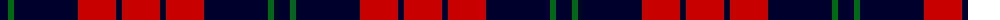

The parent of this is [Tartan TV (Corporate)](/tartans/db/16/g6/db64/ra38/db6/ra/38/)

This was sourced from tartans-authority.  It is a [6 stripes tartan](/stripes/stripes6/).

Original link http://www.tartansauthority.com/tartan-ferret/display/3906/

## Thread count
DB/16 G6 DB64 Ra38 DB6 Ra/38

## Palette
Each colour and its ΔE from the base-6 reference it is a variant of.

| Colour | Shade | Base | ΔE (OKLab) |
|---|---|---|---|
| DB |  `#00002C` | K  | 0.16 |
| G |  `#006818` | G  | 0.02 |
| R |  `#C80000` | R  | 0.00 |
| Ra |  `#C80000` | R  | 0.00 |

# Sample pattern

ID: /variants/db/16/g6/db64/ra38/db6/ra/38-db00002c-g006818-rc80000-rac80000/
