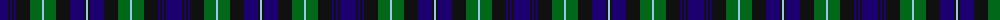

The parent of this is [Cheape of Torosay (Personal)](/tartans/db/16/k2/db2/k2/db2/k14/g12/lb2/g12/k14/db14/k2/lb/2/)

This was sourced from tartans-authority.  It is a [13 stripes tartan](/stripes/stripes13/).

Original link http://www.tartansauthority.com/tartan-ferret/display/4498/

## Thread count
DB/16 K2 DB2 K2 DB2 K14 G12 LB2 G12 K14 DB14 K2 LB/2

## Palette
Each colour and its ΔE from the base-6 reference it is a variant of.

| Colour | Shade | Base | ΔE (OKLab) |
|---|---|---|---|
| DB |  `#1C0070` | B  | 0.14 |
| G |  `#006818` | G  | 0.02 |
| K |  `#101010` | K  | 0.17 |
| LB |  `#98C8E8` | W  | 0.17 |

ID: /variants/db/16/k2/db2/k2/db2/k14/g12/lb2/g12/k14/db14/k2/lb/2-db1c0070-g006818-k101010-lb98c8e8/
