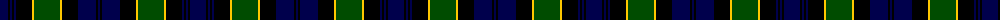

The parent of this is [Breadalbane Fencibles](/tartans/db/16/k2/db2/k2/db2/k16/y2/g26/y2/k16/db18/k2/db/2/)

This was sourced from weddslist.  It is a [13 stripes tartan](/stripes/stripes13/).

Original link http://www.weddslist.com/cgi-bin/tartans/pg.pl?source=rb

## Thread count
DB/16 K2 DB2 K2 DB2 K16 Y2 G26 Y2 K16 DB18 K2 DB/2

## Palette
Each colour and its ΔE from the base-6 reference it is a variant of.

| Colour | Shade | Base | ΔE (OKLab) |
|---|---|---|---|
| DB |  `#00004C` | B  | 0.21 |
| G |  `#004C00` | G  | 0.08 |
| K |  `#000000` | K  | 0.00 |
| Y |  `#FFC800` | Y  | 0.04 |

ID: /variants/db/16/k2/db2/k2/db2/k16/y2/g26/y2/k16/db18/k2/db/2-db00004c-g004c00-k000000-yffc800/
