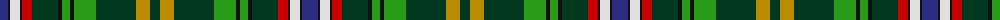

The parent of this is [Wild Geese (Corporate)](/tartans/db/16/k2/ln10/k2/r10/dg26/k4/g8/k4/g22/dg40/dy14/dg/10/)

This was sourced from tartans-authority.  It is a [13 stripes tartan](/stripes/stripes13/).

Original link http://www.tartansauthority.com/tartan-ferret/display/7400/

## Thread count
DB/16 K2 LN10 K2 R10 DG26 K4 G8 K4 G22 DG40 DY14 DG/10

## Palette
Each colour and its ΔE from the base-6 reference it is a variant of.

| Colour | Shade | Base | ΔE (OKLab) |
|---|---|---|---|
| DB |  `#2C2C80` | B  | 0.05 |
| DG |  `#003820` | G  | 0.16 |
| DY |  `#BC8C00` | Y  | 0.16 |
| G |  `#289C18` | G  | 0.18 |
| K |  `#101010` | K  | 0.17 |
| LN |  `#E0E0E0` | W  | 0.06 |
| R |  `#C80000` | R  | 0.00 |

ID: /variants/db/16/k2/ln10/k2/r10/dg26/k4/g8/k4/g22/dg40/dy14/dg/10-db2c2c80-dg003820-dybc8c00-g289c18-k101010-lne0e0e0-rc80000/
